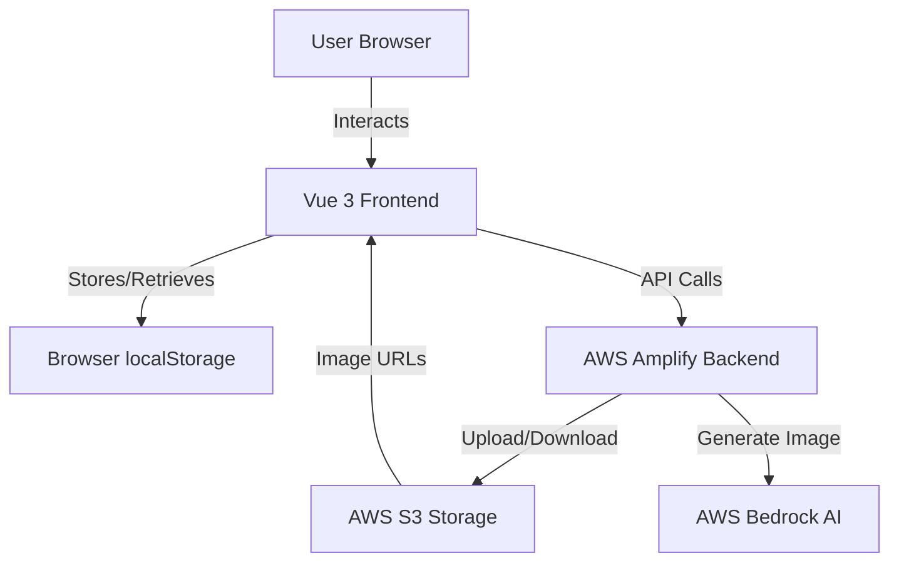
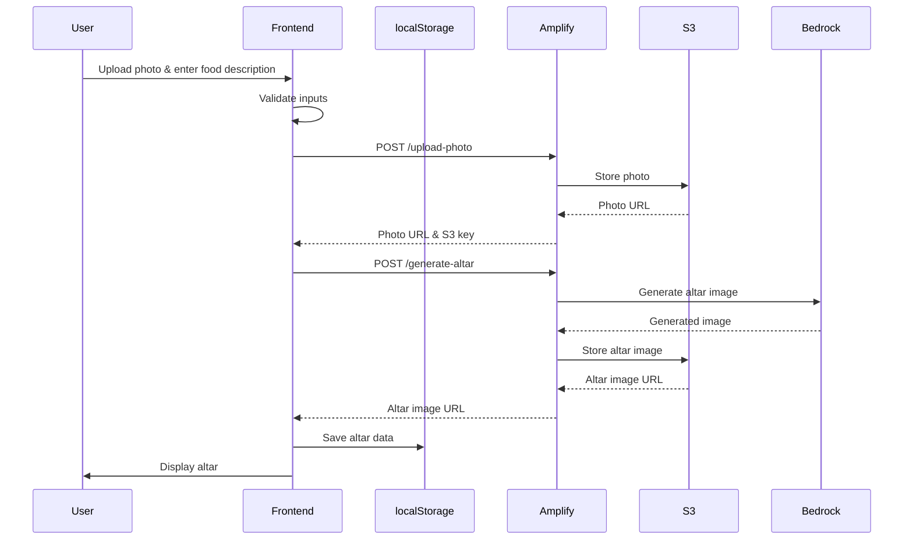
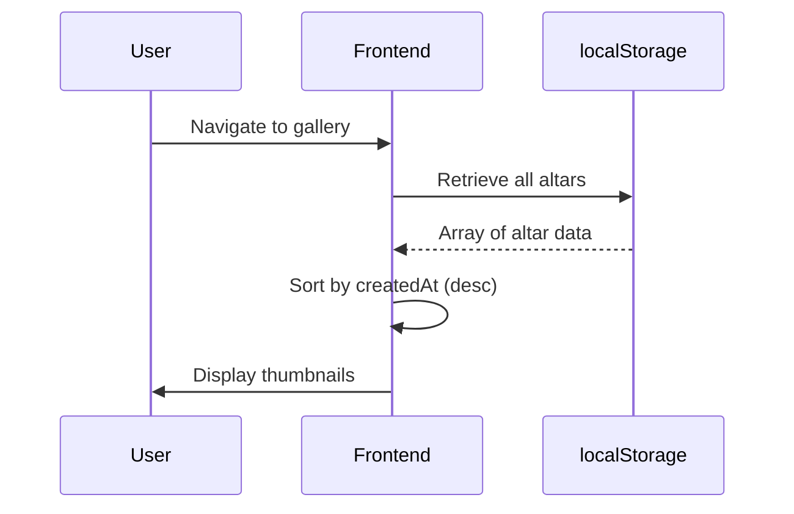

# Design Document

## Overview

The Altar application is a single-page web application built with Vue 3 (Composition API), TypeScript, and Pinia for state management. The frontend communicates with an AWS Amplify backend that orchestrates AWS Bedrock for AI image generation and S3 for storage. The application provides a culturally respectful interface for creating digital Día de Muertos altars without requiring user authentication.

### Key Design Principles

- **Simplicity First**: No authentication barriers - users can immediately create altars
- **Cultural Sensitivity**: Design elements honor Mexican Día de Muertos traditions
- **Progressive Enhancement**: Core functionality works first, enhanced features layer on top
- **Mobile-First**: Responsive design optimized for touch interfaces
- **Performance**: Fast load times and responsive interactions

## Architecture

### High-Level Architecture



### Technology Stack

**Frontend:**
- Vue 3 with Composition API and `<script setup>` syntax
- TypeScript 3+ for type safety
- Pinia for centralized state management
- Vue Router for navigation (Create, Gallery, View)
- Vite as build tool
- TailwindCSS for responsive styling

**Backend:**
- AWS Amplify Gen 2 for backend infrastructure
- AWS Bedrock (Stable Diffusion or DALL-E model) for image generation
- AWS S3 for photo and generated image storage
- AWS Lambda functions for business logic

**Storage:**
- Browser localStorage for altar persistence
- S3 for image file storage

## Components and Interfaces

### Frontend Component Structure

```
src/
├── main.ts
├── App.vue
├── router/
│   └── index.ts
├── stores/
│   └── altarStore.ts
├── views/
│   ├── CreateView.vue
│   ├── GalleryView.vue
│   └── AltarDetailView.vue
├── components/
│   ├── PhotoUpload.vue
│   ├── FoodDescriptionInput.vue
│   ├── AltarDisplay.vue
│   ├── AltarCard.vue
│   ├── LoadingSpinner.vue
│   └── ErrorMessage.vue
├── services/
│   ├── amplifyService.ts
│   ├── storageService.ts
│   └── localStorageService.ts
├── types/
│   └── altar.ts
└── utils/
    ├── validators.ts
    └── fileHelpers.ts
```

### Core Data Models

```typescript
// types/altar.ts

export interface Altar {
  id: string;
  photoUrl: string;
  photoS3Key: string;
  foodDescription: string;
  altarImageUrl: string;
  altarImageS3Key: string;
  createdAt: string; // ISO 8601 timestamp
}

export interface CreateAltarRequest {
  photoFile: File;
  foodDescription: string;
}

export interface CreateAltarResponse {
  altarId: string;
  photoUrl: string;
  altarImageUrl: string;
}

export interface UploadPhotoResponse {
  photoUrl: string;
  s3Key: string;
}

export interface GenerateAltarRequest {
  photoS3Key: string;
  foodDescription: string;
}

export interface GenerateAltarResponse {
  altarImageUrl: string;
  altarImageS3Key: string;
}
```

### Pinia Store Design

```typescript
// stores/altarStore.ts

export interface AltarState {
  altars: Altar[];
  currentAltar: Altar | null;
  isLoading: boolean;
  error: string | null;
  uploadProgress: number;
}

export const useAltarStore = defineStore('altar', {
  state: (): AltarState => ({
    altars: [],
    currentAltar: null,
    isLoading: false,
    error: null,
    uploadProgress: 0
  }),
  
  actions: {
    async createAltar(request: CreateAltarRequest): Promise<Altar>
    async loadAltarsFromStorage(): Promise<void>
    async deleteAltar(altarId: string): Promise<void>
    setCurrentAltar(altar: Altar): void
    clearError(): void
  },
  
  getters: {
    sortedAltars: (state) => Altar[]
    hasAltars: (state) => boolean
  }
});
```

### Component Interfaces

**PhotoUpload.vue**
- Props: `modelValue: File | null`, `maxSizeM: number`
- Emits: `update:modelValue`, `error`
- Features: Drag-and-drop, file validation, image preview

**FoodDescriptionInput.vue**
- Props: `modelValue: string`, `maxLength: number`, `minLength: number`
- Emits: `update:modelValue`
- Features: Character counter, validation feedback

**AltarDisplay.vue**
- Props: `altar: Altar`, `showDownload: boolean`
- Emits: `download`
- Features: Full-size image display, download button

**AltarCard.vue**
- Props: `altar: Altar`
- Emits: `click`, `delete`
- Features: Thumbnail display, delete confirmation

### Backend API Design

**Amplify Functions:**

1. **uploadPhoto**
   - Method: POST
   - Endpoint: `/api/upload-photo`
   - Input: Multipart form data with image file
   - Output: `{ photoUrl: string, s3Key: string }`
   - Validates file type and size, uploads to S3

2. **generateAltar**
   - Method: POST
   - Endpoint: `/api/generate-altar`
   - Input: `{ photoS3Key: string, foodDescription: string }`
   - Output: `{ altarImageUrl: string, altarImageS3Key: string }`
   - Constructs prompt, calls Bedrock, stores result in S3

**Prompt Engineering for Bedrock:**

```
Create a traditional Mexican Día de Muertos altar (ofrenda) with the following elements:
- A framed photograph of [uploaded photo]
- Traditional altar decorations including marigold flowers (cempasúchil), candles, papel picado
- The following foods prominently displayed: [food description]
- Warm, respectful lighting
- Vibrant colors typical of Día de Muertos celebrations
- Cultural authenticity and reverence

Style: Photorealistic, warm tones, culturally respectful
```

## Data Flow

### Creating an Altar



### Loading Gallery



## Error Handling

### Frontend Error Handling

**File Upload Errors:**
- Invalid file type → "Please upload a JPEG, PNG, or WEBP image"
- File too large → "Image must be under 10MB"
- Upload failure → "Upload failed. Please try again"

**Generation Errors:**
- Timeout (>30s) → "Generation is taking longer than expected. Please try again"
- API error → "Unable to generate altar. Please try again"
- Network error → "Connection lost. Please check your internet"

**localStorage Errors:**
- Quota exceeded → "Storage full. Please delete some altars"
- Access denied → "Unable to save. Please check browser settings"

### Backend Error Handling

**Lambda Functions:**
- Input validation errors → 400 Bad Request
- S3 upload failures → Retry 3 times, then 500 Internal Server Error
- Bedrock timeout → 504 Gateway Timeout
- Bedrock content policy violation → 400 Bad Request with specific message

**Error Response Format:**
```typescript
interface ErrorResponse {
  error: string;
  message: string;
  code: string;
}
```

## Testing Strategy

### Unit Tests

**Frontend:**
- Pinia store actions and getters
- Validation functions (file type, size, text length)
- localStorage service methods
- File helper utilities

**Backend:**
- Lambda function handlers
- Input validation logic
- S3 upload/download operations
- Prompt construction for Bedrock

### Integration Tests

- Photo upload → S3 storage → URL retrieval
- Altar generation → Bedrock call → S3 storage
- localStorage save → retrieve → delete operations
- Component interactions (upload → preview → submit)

### End-to-End Tests

- Complete altar creation flow
- Gallery view and navigation
- Altar deletion
- Download functionality
- Responsive behavior on different screen sizes

### Manual Testing Checklist

- [ ] Upload various image formats (JPEG, PNG, WEBP)
- [ ] Test file size limits (under/over 10MB)
- [ ] Verify character counter and validation
- [ ] Test on mobile devices (iOS Safari, Android Chrome)
- [ ] Verify localStorage persistence across sessions
- [ ] Test with slow network conditions
- [ ] Verify cultural appropriateness of generated images
- [ ] Test accessibility with screen readers

## Performance Considerations

### Frontend Optimization

- Lazy load gallery images
- Implement virtual scrolling for large galleries
- Compress uploaded images before sending to backend
- Use WebP format for thumbnails
- Cache Amplify API responses where appropriate

### Backend Optimization

- Use S3 presigned URLs for direct uploads (future enhancement)
- Implement CloudFront CDN for image delivery
- Set appropriate S3 lifecycle policies for old images
- Use Bedrock's async generation if available
- Implement request throttling to prevent abuse

### localStorage Management

- Limit stored altars to 50 most recent
- Store only URLs and metadata, not image data
- Implement cleanup for orphaned entries
- Provide user option to clear all data

## Security Considerations

### Frontend Security

- Sanitize food description input to prevent XSS
- Validate file types using magic numbers, not just extensions
- Implement CSP headers
- Use HTTPS only
- No sensitive data in localStorage

### Backend Security

- Implement rate limiting on API endpoints
- Validate all inputs server-side
- Use IAM roles with least privilege
- Enable S3 bucket encryption
- Implement CORS properly
- Monitor Bedrock usage for abuse
- Set S3 object expiration policies

### Content Moderation

- Implement content filtering on food descriptions
- Monitor Bedrock outputs for inappropriate content
- Provide user reporting mechanism (future enhancement)

## Deployment Strategy

### Infrastructure as Code

Use AWS Amplify Gen 2 with CDK for:
- Lambda functions
- S3 buckets with proper policies
- Bedrock model access
- API Gateway configuration

### Environment Configuration

**Development:**
- Local Vite dev server
- Amplify sandbox environment
- Mock Bedrock responses for faster iteration

**Production:**
- Amplify hosting for frontend
- Production Bedrock model
- CloudFront distribution
- Monitoring and logging enabled

### CI/CD Pipeline

1. Code push to GitHub
2. Run linting and type checking
3. Run unit tests
4. Build frontend
5. Deploy to Amplify
6. Run smoke tests
7. Monitor for errors

## Accessibility

- Semantic HTML elements
- ARIA labels for interactive elements
- Keyboard navigation support
- Alt text for images
- Color contrast compliance (WCAG AA)
- Focus indicators
- Screen reader announcements for async operations

## Internationalization

**Phase 1 (MVP):**
- Spanish language interface
- Cultural elements appropriate for Mexican tradition

**Future Enhancement:**
- English language option
- Localized date formats
- RTL support if needed

## Future Enhancements

- Social sharing capabilities
- Custom altar templates
- Multiple photos per altar
- Video tributes
- Collaborative altars
- Print-optimized layouts
- QR code generation for physical altars
- Analytics dashboard
